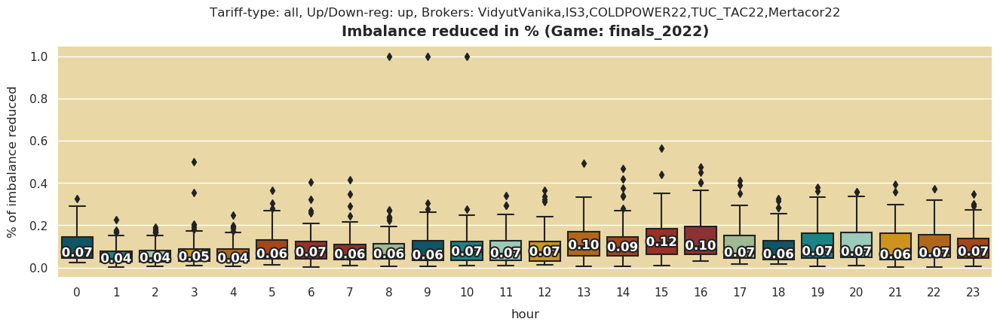
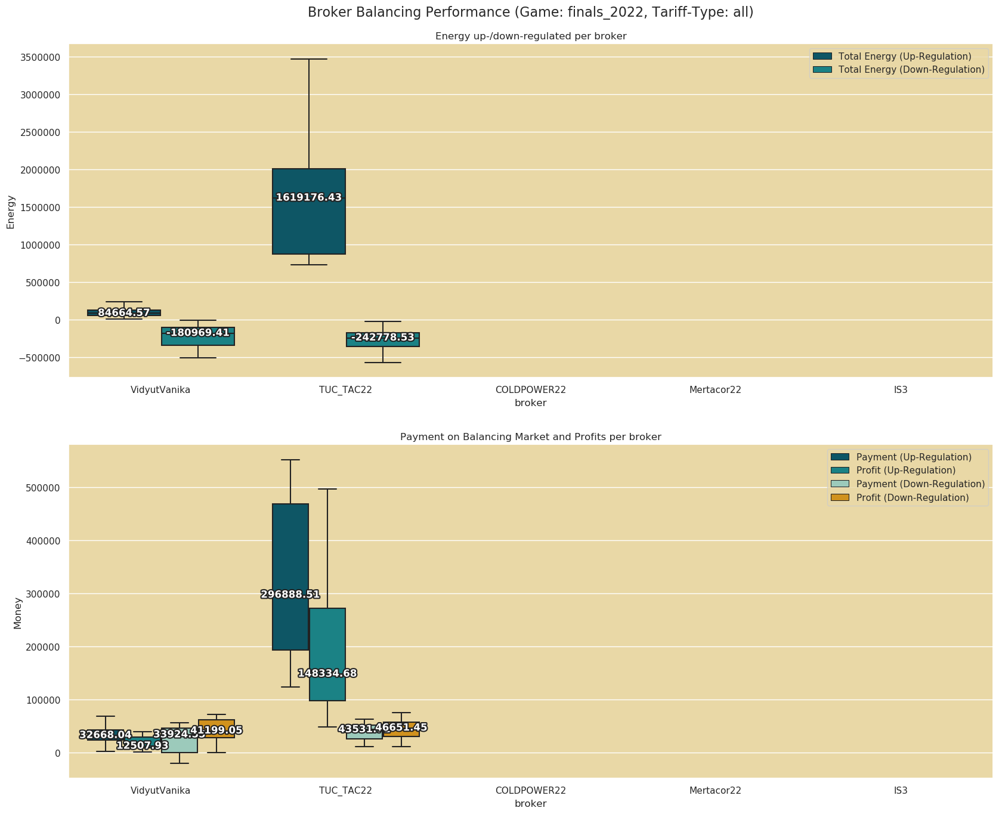
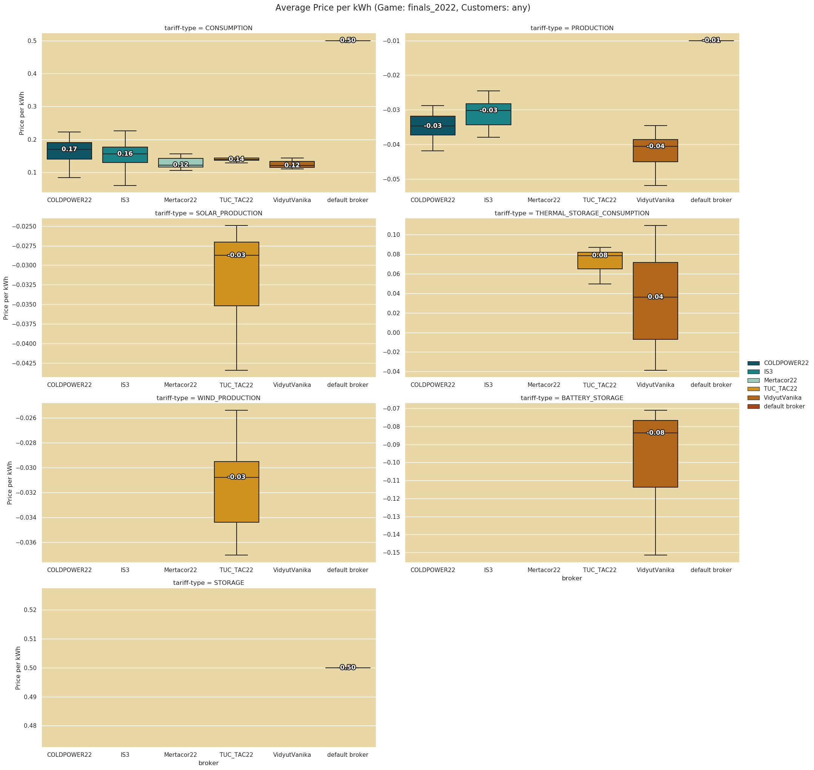
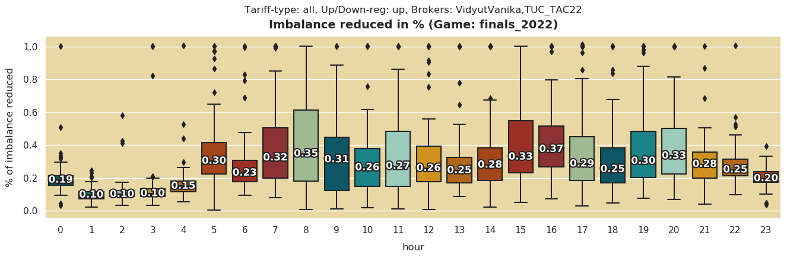
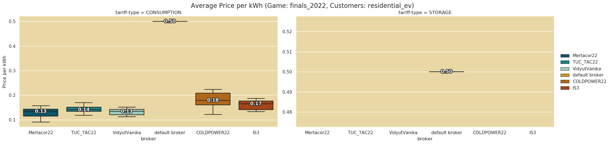
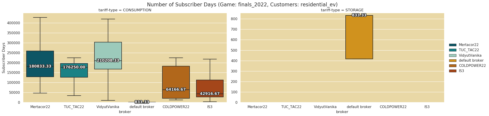

<!-- PROJECT LOGO -->
<br />
<div align="center">
  <a href="https://github.com/github_username/repo_name">
    
  </a>

<h3 align="center">PowerTAC Analysis Tools</h3>

  <p align="center">
    This repository collects the currently available analysis tools focusing on a variety of KPIs, <br>
    e.g. the reduction of power imbalances, the utilization of the balancing capacities and tariff type data.
  </p>
</div>


<!-- TABLE OF CONTENTS -->
<details>
  <summary>Table of Contents</summary>
  <ol>
    <li>
      <a href="#getting-started">Getting Started</a>
      <ul>
        <li><a href="#prerequisites">Prerequisites</a></li>
        <li><a href="#installation">Installation</a></li>
      </ul>
    </li>
    <li><a href="#usage">Usage</a></li>
    <li><a href="#roadmap">Roadmap</a></li>
    <li><a href="#contact">Contact</a></li>
  </ol>
</details>


<!-- GETTING STARTED -->
## Getting Started

### Prerequisites

* Python

### Installation

1. Clone the repo
   ```sh
   git clone https://github.com/ducanhnguyen99/is3-powertac-ev-kpis.git
   ```
2. Download games
3. Create folder structure 
* create folder with games to be analyzed and the output folder
4. Set paths inside the utility config file (analysis -> notebooks -> analysis_tools)

<p align="right">(<a href="#readme-top">back to top</a>)</p>


<!-- USAGE EXAMPLES -->
## Usage

### Folder Structure
* analysis: contains exploratory notebooks, analysis tools and the output folder <br>
    * output_all: output folder <br>
    * notebooks: contains the analysis tools as .py files to be executed with desired arguments and tools to conduct analysis <br>
        * analysis_tools: contains these tools to transform and plot the data as well as utility functions <br>
            * analyzers: plotter for imbalance reduced, balancing capacity utilization and tariff type data <br>
            * transformers: transformer for imbalance reduced, balancing capacity utilization and tariff type data <br>
            * extractors: currently empty
            * utility.py: contains config for color palette, paths and destinations and helper functions

### General process of using analysis tool

 

<p align="right">(<a href="#readme-top">back to top</a>)</p> 
Exemplary command-line execution (inside the folder of the .py file)

   ```sh
   python3 kpi3_tariff_type_group.py finals_2022 VidyutVanika,IS3,COLDPOWER22,TUC_TAC22,Mertacor22
   ```

### KPI1 - Reduced imbalance through balancing
This boxplot shows the hourly reduced imbalance of supply and demand through balancing efforts of the selected brokers. Goal is to minimize this imbalance 
as a market equilibrium is required for stable electricity supply. Balancing through curtailment of energy or storing can mitigate shortage or oversupply of energy.

On the x-axis the hours of a day and on the y axis the fraction of imbalance reduced is shown. The value of each of the boxes median is displayed. 
The title indicates the group of game, the involved brokers, the type of imbalance and the tarifftypes analyzed (in respect to balancing efforts). 
This plot aggregates across all specified games.

```sh
python3 kpi1_imb_reduced_group.py powertype imbalance-type game-name broker-names
```
Input values: <br>
powertypes: all, BATTERY_STORAGE, THERMAL_STORAGE_CONSUMPTION (currently the only balancing tarifftypes) <br> 
imbalance-type: both, up, down  <br>
game-name: finals_2022  <br>
broker-names: comma separated broker names without blank spaces e.g. IS3,COLDPOWER22

 

The title states that all tariff types, only up-regulation imbalance meaning shortage of energy in relation to curtailed energy and the five brokers are included. The selected group of games is finals_2022. For example, the hour 15 shows the highest average reduced imbalance through up-regulation in these 5 brokers (12% on average of the total imbalance reduced).

### KPI2 - Utilization of balancing capacities of brokers
This boxplot shows the energy a broker up/down-regulates, the payments and profit made through balancing efforts.

The two plots show on x-axis the brokers involved. The first plot shows the energy that was traded in up and down-regulation. Up-regulation meaning 
the balancing broker curtails energy consumption of the customer as there is a shortage of energy. Down-regulation meaning the balancing broker e.g. stores it and uses up  the oversupply of energy. Other brokers 
creating the imbalance get paid by the balancing broker or pay respectively.

```sh
python3 kpi2_broker_performance_group.py tarifftype game-name broker-names
```
Input values:  <br>
tarifftypes: all, BATTERY_STORAGE, THERMAL_STORAGE_CONSUMPTION  <br>
game-name: finals_2022  <br>
broker-names: comma separated broker names without blank spaces e.g. IS3,COLDPOWER22

 

The title indicates the game finals_2022 and all tariff types considered, for the five brokers on the x-axis. VidyutVanika up-regulated 84664.57 energy and made 12507.93 money profit with it (curtailing energy usage of customer in exchange for payment during shortage but receiving payments from other brokers contributing to imbalance). -180969 energy was down-regulated and 41199 money was made (customer charges during oversupply and pays the broker less than usual but broker pays even less energy to the other brokers who contributed to this oversupply, in rare cases these brokers even have to pay the balancing broker).

### KPI3 - Tariff type KPIs (number of publications, subscribers, energy traded, average price)
These boxplots are split up on a facet grid depending on the tariff type we look at to enable better comparison of the aforementioned KPIs. We compare among the brokers the number of tarifftypes published, the number of customer subscribed days, the amount of energy traded and the average price per kWh. Additionally one can isolate the analysis to certain customer groups e.g. residential_ev.

```sh
python3 kpi3_tariff_type_group.py game-name broker-names customer-names
```
Input values:  <br>
game-name: finals_2022  <br>
broker-names: comma separated broker names without blank spaces e.g. IS3,COLDPOWER22
customer-names: comma separated customer names without blank spaces e.g. residential_ev,FrostyStorage

 
The boxplots are built in the same fashion with the title stating the game finals_2022, the customers included (any) and different facets of tariff-type. The x-axis shows the 5 included brokers.
For consumption this means e.g. VidyutVanika receives 0.12 money per kWh and for production they pay 0.04 money per kWh.

### Exemplary Insights Generated
#### Only VidyutVanika and TUC_TAC22 utilize the balancing capacities with their tariffs
 
When looking at all types of tariffs, only these two brokers show some up-/down-regulation and corresponding profits.

#### Overall market imbalance reduced varies heavily if more brokers are involved in balancing
 
 
As only two brokers utilize the balancing capacities, the comparison of the reduced imbalance in market differs between games where only balancing brokers are involved vs. all brokers involved. This might be due to the distribution of customers who now subscribe into many different brokers which offer no balancing tariffs.

#### EV-residential customer prices
 
 
Comparing the prices Mertacor22, TUC_TAC22 and VidyutVanika offer the lowest prices for the electric vehicles. This is also reflected in the number of subscriber days, averaging the highest for these three brokers.

#### Prices for Battery Storage
 
The plot shows that customers subscribing to the tariff BATTERY-STORAGE even receive money for charging. This is likely due to the compensation of curtailment. The brokers still make profit as they receive payments from the other brokers that contribute to the imbalances.

<!-- ROADMAP -->
## Roadmap

- [ ] Feature 1
- [ ] Feature 2
- [ ] Feature 3


<p align="right">(<a href="#readme-top">back to top</a>)</p>


<!-- CONTACT -->
## Contact

Your Name - [@Vu Duc Anh Nguyen](https://www.linkedin.com/in/duc-anh-nguyen-09132b21a/) - duc.anh.nguyen@outlook.de

Project Link: [https://github.com/ducanhnguyen99/is3-powertac-ev-kpis](https://github.com/ducanhnguyen99/is3-powertac-ev-kpis)

<p align="right">(<a href="#readme-top">back to top</a>)</p>


<!-- MARKDOWN LINKS & IMAGES -->
<!-- https://www.markdownguide.org/basic-syntax/#reference-style-links -->
[contributors-shield]: https://img.shields.io/github/contributors/github_username/repo_name.svg?style=for-the-badge
[contributors-url]: https://github.com/github_username/repo_name/graphs/contributors
[forks-shield]: https://img.shields.io/github/forks/github_username/repo_name.svg?style=for-the-badge
[forks-url]: https://github.com/github_username/repo_name/network/members
[stars-shield]: https://img.shields.io/github/stars/github_username/repo_name.svg?style=for-the-badge
[stars-url]: https://github.com/github_username/repo_name/stargazers
[issues-shield]: https://img.shields.io/github/issues/github_username/repo_name.svg?style=for-the-badge
[issues-url]: https://github.com/github_username/repo_name/issues
[license-shield]: https://img.shields.io/github/license/github_username/repo_name.svg?style=for-the-badge
[license-url]: https://github.com/github_username/repo_name/blob/master/LICENSE.txt
[linkedin-shield]: https://img.shields.io/badge/-LinkedIn-black.svg?style=for-the-badge&logo=linkedin&colorB=555
[linkedin-url]: https://linkedin.com/in/linkedin_username
[product-screenshot]: images/screenshot.png
[Next.js]: https://img.shields.io/badge/next.js-000000?style=for-the-badge&logo=nextdotjs&logoColor=white
[Next-url]: https://nextjs.org/
[React.js]: https://img.shields.io/badge/React-20232A?style=for-the-badge&logo=react&logoColor=61DAFB
[React-url]: https://reactjs.org/
[Vue.js]: https://img.shields.io/badge/Vue.js-35495E?style=for-the-badge&logo=vuedotjs&logoColor=4FC08D
[Vue-url]: https://vuejs.org/
[Angular.io]: https://img.shields.io/badge/Angular-DD0031?style=for-the-badge&logo=angular&logoColor=white
[Angular-url]: https://angular.io/
[Svelte.dev]: https://img.shields.io/badge/Svelte-4A4A55?style=for-the-badge&logo=svelte&logoColor=FF3E00
[Svelte-url]: https://svelte.dev/
[Laravel.com]: https://img.shields.io/badge/Laravel-FF2D20?style=for-the-badge&logo=laravel&logoColor=white
[Laravel-url]: https://laravel.com
[Bootstrap.com]: https://img.shields.io/badge/Bootstrap-563D7C?style=for-the-badge&logo=bootstrap&logoColor=white
[Bootstrap-url]: https://getbootstrap.com
[JQuery.com]: https://img.shields.io/badge/jQuery-0769AD?style=for-the-badge&logo=jquery&logoColor=white
[JQuery-url]: https://jquery.com 
